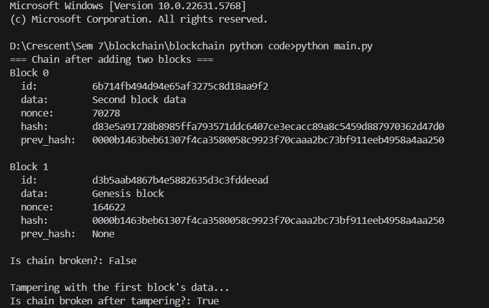
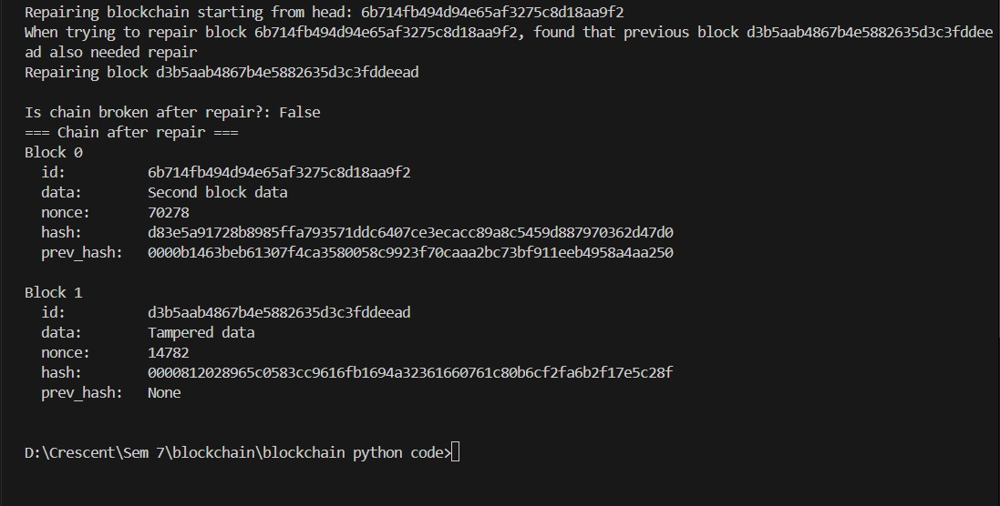

# Blockchain Technology (Python Implementation)

This project is a simple implementation of **Blockchain Technology** using Python.  
It demonstrates how blocks are created, linked, tampered with, and repaired to maintain the integrity of the chain.

---

## 🚀 Features
- Block creation with unique **hashes** and **nonces**  
- Linking of blocks via **previous hash** values  
- Detection of **tampered data** in the blockchain  
- Automatic **repair mechanism** to restore chain integrity  

---

## 📂 Project Structure
```
BlockChain_Technology/
│── main.py              # Entry point for running the blockchain demo
│── blockchain.py        # Contains Block and Blockchain classes
│── README.md            # Project documentation
```
---

## ▶️ How to Run
1. Clone the repository:
   ```bash
   git clone https://github.com/ArsheeFathimaS/BlockChain_Technology.git
   ```
2. Navigate to the project folder:
   ```bash
   cd BlockChain_Technology
   ```
3. Run the main script:
   ```bash
   python main.py
   ```

---

## 🖼 Output Screenshots

### ✅ Blockchain after adding blocks and tampering detection


### 🔧 Repairing blockchain after tampering


---

## 📖 Explanation
- A **block** contains:
  - `id`: Unique identifier  
  - `data`: Stored information  
  - `nonce`: Proof-of-work value  
  - `hash`: SHA-256 hash of the block  
  - `prev_hash`: Reference to the previous block  

- The program:
  1. Creates two blocks and links them.  
  2. Verifies whether the chain is intact (`Is chain broken?`).  
  3. Demonstrates tampering with a block’s data and detecting the break.  
  4. Repairs the blockchain by recalculating hashes, restoring integrity.  

---

## 📌 Example Use Cases
- Educational purposes (understanding blockchain basics)  
- Simulation of tampering and repair in distributed ledger technology  
- Foundation for more advanced blockchain applications  

---
## 🧑‍💻 Author
**Arshee Fathima S**  
**Fasna PP**
